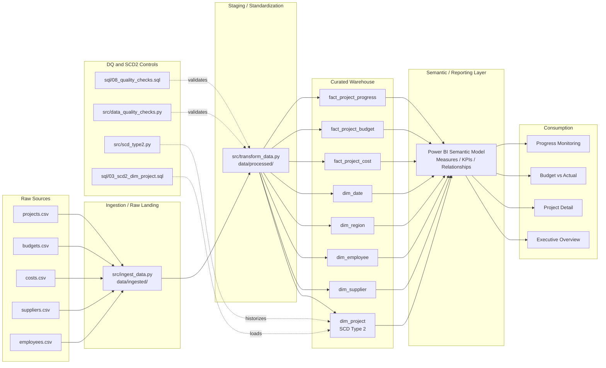

# Solution Architecture

Dieses Diagramm zeigt die logische End-to-End-Architektur des Demo-Projekts fuer Bau- und Immobilien-Projektcontrolling.

```mermaid
flowchart LR
    subgraph Sources["Raw Sources"]
        P["projects.csv"]
        B["budgets.csv"]
        C["costs.csv"]
        S["suppliers.csv"]
        E["employees.csv"]
    end

    subgraph Ingestion["Ingestion / Raw Landing"]
        I["src/ingest_data.py<br/>data/ingested/"]
    end

    subgraph Staging["Staging / Standardization"]
        T["src/transform_data.py<br/>data/processed/"]
    end

    subgraph Warehouse["Curated Warehouse"]
        D1["dim_project<br/>SCD Type 2"]
        D2["dim_supplier"]
        D3["dim_employee"]
        D4["dim_region"]
        D5["dim_date"]
        F1["fact_project_cost"]
        F2["fact_project_budget"]
        F3["fact_project_progress"]
    end

    subgraph Controls["DQ and SCD2 Controls"]
        Q1["sql/08_quality_checks.sql"]
        Q2["src/data_quality_checks.py"]
        Q3["src/scd_type2.py"]
        Q4["sql/03_scd2_dim_project.sql"]
    end

    subgraph Semantic["Semantic / Reporting Layer"]
        PB["Power BI Semantic Model<br/>Measures / KPIs / Relationships"]
    end

    subgraph Consumption["Consumption"]
        R1["Executive Overview"]
        R2["Project Detail"]
        R3["Budget vs Actual"]
        R4["Progress Monitoring"]
    end

    P --> I
    B --> I
    C --> I
    S --> I
    E --> I

    I --> T
    T --> D1
    T --> D2
    T --> D3
    T --> D4
    T --> D5
    T --> F1
    T --> F2
    T --> F3

    Q1 -. validates .-> T
    Q2 -. validates .-> T
    Q3 -. historizes .-> D1
    Q4 -. loads .-> D1

    D1 --> PB
    D2 --> PB
    D3 --> PB
    D4 --> PB
    D5 --> PB
    F1 --> PB
    F2 --> PB
    F3 --> PB

    PB --> R1
    PB --> R2
    PB --> R3
    PB --> R4
```
